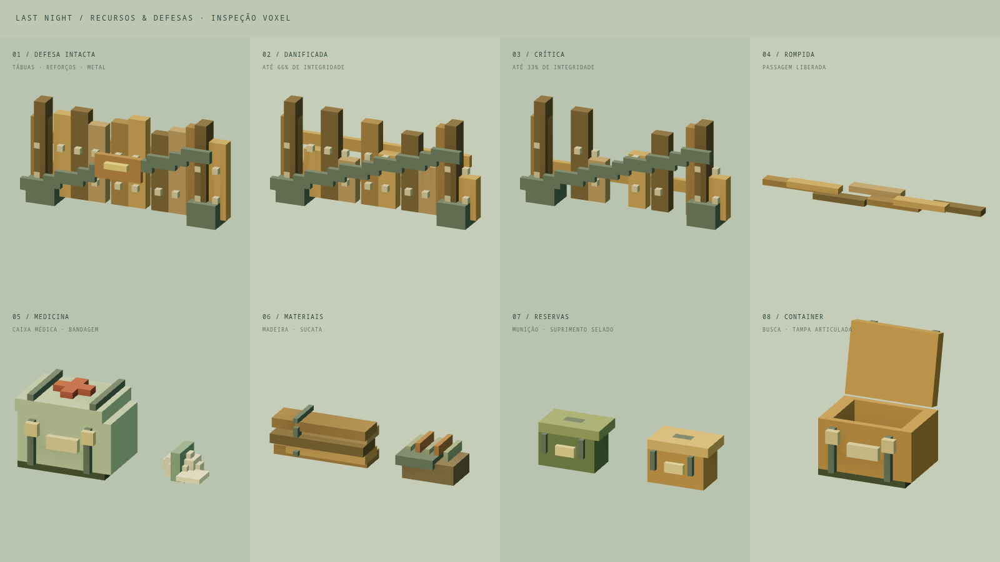
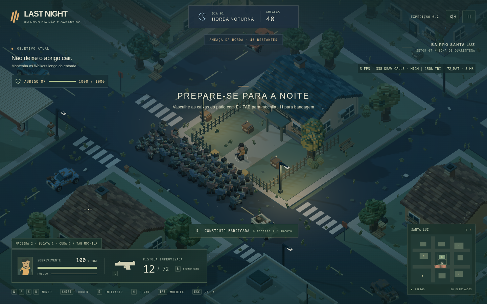

# LAST NIGHT — loop de sobrevivência

Esta etapa estende o projeto voxel existente com exploração, loot, mochila, defesa do abrigo e noites com conclusão por eliminação da horda. Não adiciona multiplayer, novas armas, novos tipos de inimigo, crafting complexo ou progressão permanente. Nenhum commit, push, tag ou alteração de histórico Git foi realizado.

## O loop implementado

**Dia → aviso de anoitecer → preparação → noite → silêncio → amanhecer → próximo dia.**

O jogador começa no pátio com o objetivo de se preparar. A reserva inicial garante munição e materiais para erguer uma barricada. Explorar hospital, delegacia, mercado, posto e casas permite obter recursos adequados a necessidades diferentes. A mochila limita a carga; retornar ao abrigo permite guardar itens e usar o depósito nas defesas.

A iluminação e o vento mudam conforme a fase. Há avisos a 60 e 30 segundos e contagem destacada nos últimos 10. A primeira noite envia 18 Walkers em três grupos com intervalos. Quando todos os grupos chegaram e todos os inimigos restantes morreram, há três segundos de silêncio e dez de amanhecer. A recompensa é depositada uma única vez; a próxima noite tem 24 inimigos.

A noite não termina por expirar um cronômetro. Inimigos diurnos ainda vivos também precisam ser eliminados. O controlador `MatchCycle` é a autoridade das fases; `Horde` organiza os grupos dentro da noite. A simulação continua baseada em comandos, eventos e passo fixo.

## Recursos, loot e inventário

São cinco recursos: **munição, bandagem, madeira, sucata e reserva selada**. A reserva selada é um suprimento raro que recupera até 250 HP do abrigo. Não há um novo armamento jogável.

Há **15 containers**, em posições verificadas fora dos obstáculos do mapa. Hospital favorece medicina, delegacia favorece munição, mercado favorece materiais gerais e posto favorece sucata/ferramentas. Casas têm tabelas variadas. O sorteio usa pesos e o RNG determinístico da simulação; algumas primeiras buscas têm garantias para evitar uma abertura sem recursos úteis.

Vasculhar dura 0,75 s, com tampa articulada, movimento discreto, som, modelo do recurso encontrado e mensagem. A primeira busca sorteia o conteúdo uma única vez. Transferências respeitam capacidade; sobras permanecem no container, inclusive após uma tentativa com mochila cheia. Itens não são duplicados nem descartados silenciosamente. Apenas uma parte dos containers esvaziados é reabastecida no próximo dia; sobras são preservadas e a caixa inicial de munição permanece esgotada.

A mochila tem **18 unidades de carga**. Cada categoria mostra quantidade, função e ações de descarte; perto da base, também permite guardar e retirar. O depósito não tem limite de carga e abastece os custos das defesas. A munição de reserva tem uma única origem no inventário, separada do pente da pistola. Recarga transfere somente os cartuchos necessários.

A bandagem recupera até 45 HP após 2,4 s. Movimento, tiro, recarga ou dano interrompem a aplicação; consumo acontece na conclusão. Não consome com vida cheia e não ultrapassa 100 HP. A mochila aberta mantém o tempo em movimento; a pausa explícita e a perda de foco congelam simulação e interações.

## Barricadas e abrigo

Três posições planejadas aproveitam o layout existente: **entrada principal, acesso oeste e acesso leste**. Cada barricada custa 6 madeira e 2 sucata, leva 1,2 s e tem 300 HP. A colocação é recusada quando há jogador ou Walker ocupando o espaço. Não há posicionamento livre.

Barricadas bloqueiam movimentação de jogador e inimigos. O jogador pode disparar por cima da defesa baixa. **Segurar E** repara até 90 HP em dois segundos por 1 madeira e 1 sucata. Soltar, mover ou sofrer dano interrompe; não há reparo gratuito. O estado é revalidado antes de cobrar recursos, inclusive se a estrutura for destruída durante a ação.

Os quatro estados visuais são malhas voxel detalhadas: íntegra, danificada, crítica e destroços. As versões são pré-geradas e compartilhadas. Golpes provocam realce, vibração breve, som e pequenos detritos; ao quebrar, a colisão é removida e os inimigos recalculam a rota. **X** desmonta a estrutura para liberar passagem e devolve ao depósito no máximo metade da madeira, proporcional ao HP restante.

O abrigo tem **1.000 HP**. Perto da entrada, E permite repará-lo em três segundos por 4 sucata, recuperando até 120 HP. A reserva selada oferece recuperação emergencial pelo inventário. O abrigo destruído apresenta **O ABRIGO CAIU**; a morte do jogador tem mensagem própria. Retry recria o estado da expedição e limpa efeitos temporários, sem atualizar a página.

## Horda e navegação

A horda usa três grupos internos, sem transformar a noite em uma sequência de telas. Um spawn recusado não consome orçamento. A capacidade simultânea permanece em 40 Walkers; noites posteriores acrescentam seis ao orçamento, limitado a 60.

Spawns naturais usam pontos nas bordas, a mais de 31 unidades do jogador, e consultam a câmera com margem para evitar aparições na visão imediata. A simulação recebe apenas esse predicado de visibilidade; não importa o renderizador.

O Walker persegue o jogador quando próximo. Se uma barricada intercepta sua rota, aproxima-se da face acessível e a ataca. Com o caminho livre, avança para o abrigo. Ataques não atravessam a estrutura viva ou prédios. A navegação usa grade de uma unidade, A* com heap, conectividade estática pré-calculada e máscaras reutilizadas para as combinações de barricadas. Construir ou destruir invalida os planos relevantes. A separação consulta vizinhanças espaciais em vez de comparar todos os inimigos do mapa entre si.

## HUD, arte e preservação

O HUD conserva sua identidade, com adições para recursos, mochila, progresso da interação, ameaça restante e HP numérico do abrigo. O status da base ganha destaque durante a noite. O minimapa conserva jogador, abrigo e inimigos próximos; acrescenta referências dos locais principais e defesas, sem marcar todos os containers.

Novos objetos usam receitas do sistema voxel existente: caixas, tampas, medicina, materiais, reservas e barricadas. Foram preservados, byte a byte em relação ao início desta etapa: **`voxel.ts`, `models.ts`, `town.ts`, `character-assets.ts`, `weapon-assets.ts`, `environment-assets.ts` e `building-assets.ts`**. Portanto, greedy meshing, cache, batching, instancing, modelos principais e layout visual da cidade permanecem intactos. A câmera mantém extensão 32, ângulo e acompanhamento da entrega anterior.

Iluminação, sombras suaves e efeitos continuam atmosféricos. A fase do novo controlador orienta as transições de luz. O áudio sintetizado existente recebeu sons coerentes para busca, cura, mochila, construção, reparo, dano, quebra, avisos, noite e amanhecer; não foram adicionados downloads ou packs.

## Arquivos e configurações

| Arquivos principais | Responsabilidade |
| --- | --- |
| `src/game/config.ts` | Parâmetros centralizados |
| `src/game/cycle.ts`, `horde.ts` | Fases, condição de vitória, grupos e escala |
| `src/game/inventory.ts`, `loot.ts` | Recursos, capacidade, transferências e tabelas de busca |
| `src/game/defenses.ts` | Pontos planejados e estados de integridade |
| `src/game/simulation.ts`, `world.ts` | Integração, ações, combate, colisões e navegação |
| `src/render/survival-assets.ts`, `survival-view.ts` | Novos assets voxel e instâncias persistentes |
| `src/render/scene.ts` | Integração visual, luzes, efeitos e visibilidade de spawn |
| `src/game/input.ts`, `audio.ts`, `src/main.ts` | Controles, som, pausa e reinício |
| `src/ui/hud.ts`, `src/style.css` | Extensões do HUD e inventário |
| `tests/survival.test.ts`, `survival.spec.ts`, `loop-playthrough.spec.ts`, `survival-visual.spec.ts` | Regras, cenários de navegador e inspeção |

| Configuração | Valor padrão |
| --- | ---: |
| Dia / aviso / preparação | 180 / 30 / 30 s |
| Silêncio / amanhecer | 3 / 10 s |
| Busca / cura / construção | 0,75 / 2,4 / 1,2 s |
| Carga da mochila | 18 |
| HP jogador / Walker / barricada / abrigo | 100 / 90 / 300 / 1.000 |
| Golpe em jogador / barricada / abrigo | 9 / 18 / 24 |
| Noite 1 / Noite 2 | 18 / 24 inimigos |
| Cadência inicial de spawn / intervalo adicional dos grupos | 2 / 13 s |
| Recompensa por noite | 3 sucata + 1 reserva selada |

Durações, custos, HP, velocidades, dano, frequência e escala estão em `config.ts`. Pesos, quantidades e garantias do loot ficam em `loot.ts`. Não há configuração remota.

## Correções realizadas durante a validação

- A grade anterior de duas unidades não representava bem os acessos laterais. A nova resolução e os pontos de aproximação permitem cercos pelos três lados.
- Pontos de aproximação muito próximos dos postes deixavam inimigos das bordas sem rota. Foram reposicionados no centro útil das passagens; o teste de cerco completo verifica que nenhum fica retido nas bordas.
- Conexões de navegação junto a cantos arredondados agora são verificadas com o mesmo formato de colisão usado no movimento, evitando um ponto válido de movimento ser tratado como isolado.
- O inventário passou a aproveitar a altura disponível e ocultar o minimapa enquanto aberto, mantendo os recursos acessíveis inclusive na resolução compacta.
- Esc fecha a mochila; o botão de pausa e a perda de foco pausam diretamente, incluindo ações em andamento.
- O modelo que aparece após a busca corresponde ao recurso efetivamente recebido; receitas de itens e estados de dano são pré-carregadas para evitar crescimento do cache durante o primeiro uso.
- Efeitos temporários, ações, conteúdos de containers, depósitos, hordas e defesas são reiniciados juntos. Os testes verificam consumo único, capacidade, limites de HP e ausência de recursos negativos.

## Validação final e desempenho observado

**Build de produção e TypeScript aprovados; 33 testes de código aprovados** (10 de simulação, 7 do mesher e 16 de sobrevivência). A suíte completa de **9 cenários de navegador** terminou aprovada. Após o ajuste final do texto do amanhecer e do enquadramento da galeria, o cenário visual correspondente foi repetido e aprovado. Ela cobre os dez cenários pedidos: munição, dano/cura, materiais/construção, primeira noite, dano e quebra da barricada, vitória da primeira noite, abrigo destruído, jogador morto, reinício e chegada ao Dia 2.

A expedição contínua no Chromium usou os handlers reais de teclado e mouse. Vasculhou as duas caixas do pátio, a delegacia e o hospital, retornou à base, construiu uma barricada e eliminou a horda natural de 18 Walkers, além dos inimigos diurnos. Terminou a primeira noite com **22 eliminações acumuladas**, barricada com **282/300 HP**, jogador e abrigo vivos, recebeu a recompensa e entrou na **Noite 2, com orçamento de 24 inimigos**. Não houve concessão de vida, munição, materiais ou eliminações nesse percurso. O tempo ocioso diurno foi abreviado depois da preparação, e a simulação do combate foi acelerada para viabilizar o teste por software. Isso valida integração; a mira automatizada não representa a dificuldade para uma pessoa.

O teste independente de cerco simula três minutos com todos os acessos barricados. Confirma que os três recebem ataques, são rompidos e que nenhum Walker permanece retido nas zonas de spawn. Testes menores verificam capacidade, conservação de recursos, busca sem novo sorteio, cancelamento de cura, custos de reparo, construção em espaço ocupado, pausa de ações, recompensa única e reinício limpo.

| Métrica — 40 Walkers, 1440×900, qualidade alta | Observado |
| --- | ---: |
| Draw calls | 334 |
| Triângulos | 148.390 |
| Objetos Mesh/Points na cena, incluindo pools ocultos | 493 |
| Materiais distintos | 72 |
| Geometrias registradas pelo renderer | 76 |
| Texturas | 10 |
| Receitas voxel no cache | 108 |
| Buffers de geometria da cena | 5,0 MiB |
| Buffers do cache voxel | 4,7 MiB |
| Heap informado pelo Chromium | 40,1 MiB |
| Amostra de FPS em SwiftShader | 12 |

Em relação à referência anterior de 316 draw calls, aproximadamente 148 mil triângulos e 4,8 MiB, esta amostra adicionou **18 draw calls e cerca de 0,2 MiB de geometria**. São enquadramentos de teste comparáveis, não um benchmark universal. Buffers de cena e cache se sobrepõem e não devem ser somados. A memória indicada não é o total do processo ou da GPU. FPS em **SwiftShader é renderização por software**, não estimativa de desempenho em GPU real. O teste de retry manteve o tamanho dos buffers e o número de receitas; ainda não há ensaio prolongado de vazamento.

A inspeção visual cobriu os novos assets, quatro estados da defesa, containers abertos, mochila na base e em expedição, HUD em 1024×640, contagem final, noite, amanhecer e derrota. Não foram observados erros de console nos cenários que os capturam. A prancha de assets teve o enquadramento ampliado para evitar cortes; o HUD do amanhecer foi ajustado para mostrar o próximo dia e o objetivo de sobrevivência concluído.

As tentativas preliminares identificaram os problemas de navegação e layout descritos acima. Uma execução contínua foi interrompida pelo recarregamento do Vite durante edição e depois repetida com sucesso. Na retomada final, o executável temporário do Chromium precisou ser restaurado para conferir os últimos ajustes visuais; isso não foi uma falha do jogo.

Dados: [métricas](docs/survival/loop-metrics.json) e [registro da expedição](docs/survival/loop-playthrough.json).

Capturas adicionais: [mochila compacta](docs/survival/loop-inventory-compact.png), [defesa intacta](docs/survival/loop-barricade-intact.png), [defesa crítica](docs/survival/loop-barricade-critical.png), [defesa rompida](docs/survival/loop-barricade-broken.png), [vitória e amanhecer](docs/survival/loop-dawn.png), [luz e HUD do amanhecer após o ajuste](docs/survival/loop-dawn-light.png), [segunda noite](docs/survival/loop-night-two.png) e [queda do abrigo](docs/survival/loop-shelter-defeat.png).

## Controles atualizados

| Entrada | Ação |
| --- | --- |
| WASD / Shift | Mover / correr |
| Mouse / clique esquerdo | Mirar / disparar |
| R | Recarregar |
| E | Vasculhar, recolher restante, construir ou reparar abrigo |
| Segurar E | Reparar barricada |
| H | Aplicar bandagem |
| Tab | Mochila e depósito local |
| X | Desmontar barricada próxima |
| Esc | Fechar mochila; depois, pausar/retomar |

## Limitações e próxima etapa

Esta entrega é local, single player e sem salvamento. Não há interiores, novos tipos de arma/inimigo, construção livre, crafting complexo ou metaprogressão. Destruição troca estados de malha e usa partículas; não simula física por voxel. A barra de carga é simplificada e os containers transferem automaticamente o que cabe, por categoria. Alguns pequenos props continuam sem colisão própria, como na cidade original.

O balanceamento deve ser refinado com pessoas jogando, especialmente decisões de carga, tempo de exploração e custo de reparo. A próxima etapa recomendada é realizar sessões curtas das duas primeiras noites e perfis em GPUs reais antes de adicionar mais conteúdo. Não foi iniciada outra funcionalidade.
