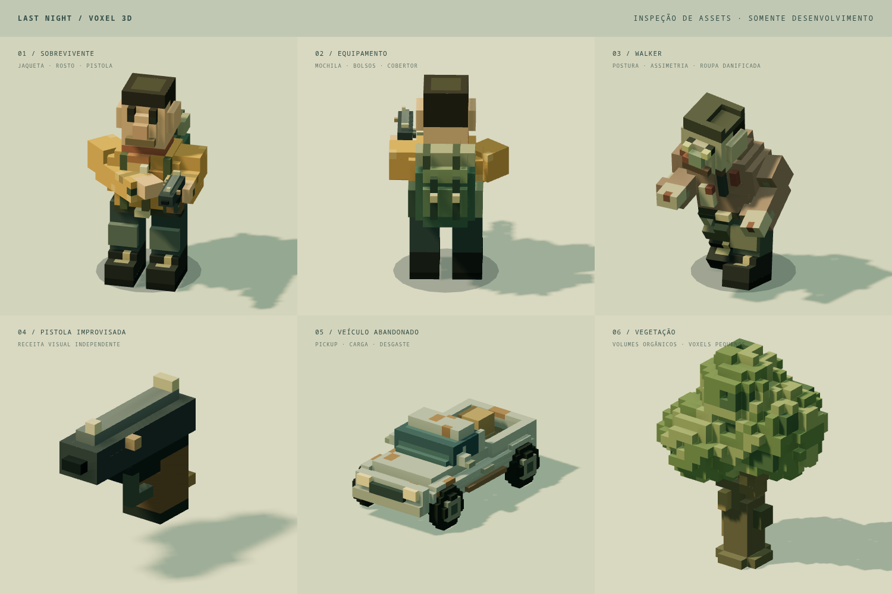
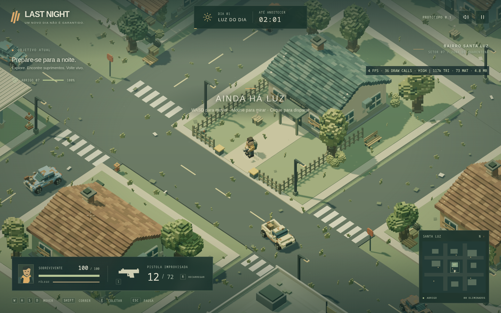
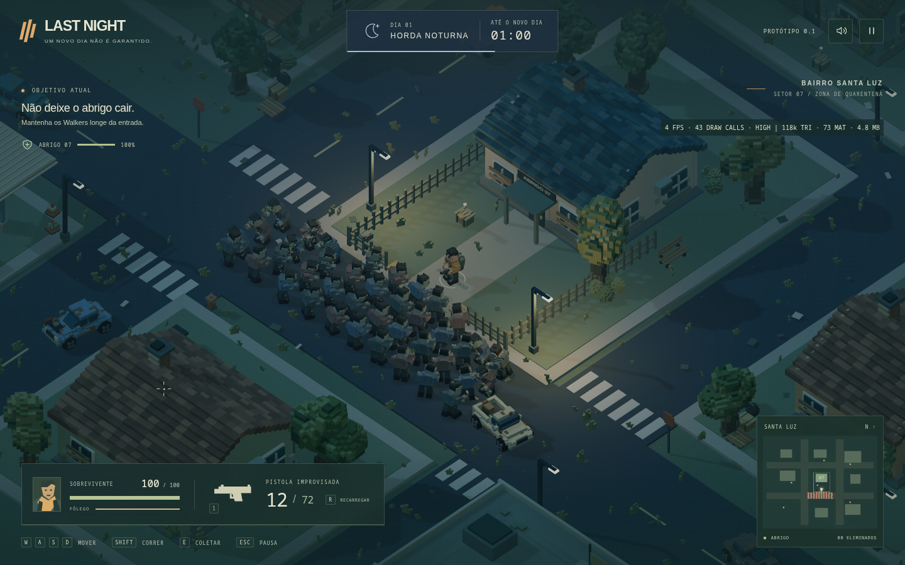

# LAST NIGHT — conversão visual para voxel

Entrega de 9 de setembro de 2026. O projeto existente foi convertido para **voxel 3D detalhado com câmera isométrica e iluminação atmosférica**, mantendo os sistemas jogáveis. Nenhum commit, push ou alteração de histórico Git foi realizado.

## Resultado visual

- **Sobrevivente:** cabeça, cabelo, rosto, mãos, roupa em camadas, bolsos, botas, joelheiras e mochila com bolsas, fivelas e rolo. Partes articuladas preservam caminhada, corrida, orientação pela mira e recuo. O braço de apoio acompanha a pistola.
- **Walker:** três variações visuais do mesmo inimigo existente, com postura curvada, cabeça inclinada, braços assimétricos, roupas rasgadas e pequenas marcas de sangue estilizado. Geometrias compartilhadas entre os integrantes da horda.
- **Pistola:** receita independente com empunhadura, ferrolho, cano, miras, guarda do gatilho e desgaste. O registro de visuais separa modelo, empunhadura e saída do disparo; permite adicionar outras armas posteriormente. Nenhuma nova arma jogável foi adicionada.
- **Construções:** cascos, coberturas, esquadrias e vegetação separados em partes. Portas, janelas, molduras, venezianas/tábuas, telhas, placas, calhas, conduítes, caixas elétricas e ar-condicionado. Hospital com cruzes, delegacia com identidade azul e escudo, mercado com toldo e posto com bombas/cobertura próprios.
- **Veículos:** sedan, pickup, carro destruído e viatura, com pneus, retrovisores, vidros escalonados, danos, ferrugem e detalhes específicos. Permanecem obstáculos estáticos.
- **Vegetação e props:** árvores com troncos irregulares, galhos e copas em volumes menores; arbustos, grama e plantas nas fachadas. Caixas, munição, kit médico, sacos, lixeiras, pallets, cones, hidrantes, bancos, caixas de correio, entulho e bombas de combustível.

As receitas usam células locais pequenas e escalas diferentes conforme o objeto — por exemplo, 0,04 unidade na pistola e 0,08 nos personagens. A grade pertence ao modelo; não transforma ruas e terreno em uma grade de blocos. A paleta combina amarelo envelhecido, verdes apagados, concreto e ferrugem, com contraste para jogador, inimigos e suprimentos.

## Implementação e arquivos

| Arquivo | Mudança |
| --- | --- |
| `src/render/voxel.ts` | Novo volume esparso, helpers de preenchimento/remoção, greedy meshing, cache, material compartilhado e receitas regeneráveis. |
| `src/render/character-assets.ts` | Novas receitas das partes articuladas do sobrevivente e dos Walkers. |
| `src/render/weapon-assets.ts` | Novo registro extensível de visuais de armas; pistola implementada. |
| `src/render/environment-assets.ts` | Novas receitas de veículos, vegetação e pequenos objetos. |
| `src/render/building-assets.ts` | Novas receitas de edifícios divididas em partes. |
| `src/render/models.ts` | Integração ao rig existente e agrupamento de geometria estática com cores de vértice. |
| `src/render/town.ts` | Substituição visual dos elementos nas posições existentes e distribuição moderada de detalhes. |
| `src/render/scene.ts` | Câmera, suprimentos voxel, iluminação de transição e compartilhamento dos recursos de efeitos. |
| `src/main.ts` | Métricas e ajuste de câmera disponíveis apenas na depuração local. |
| `tests/voxel.test.ts`, `tests/voxel-visual.spec.ts`, `tests/fixtures/` | Testes do mesher, regressão visual, galeria e cenário de estresse. |
| `package.json`, `index.html`, `README.md` | Comando de testes e documentação da direção visual; nenhuma dependência nova. |

Cada voxel é um dado, **não um Mesh**. O mesher elimina faces internas e combina faces adjacentes da mesma cor. A descoberta inicial de faces percorre células ocupadas, reduzindo o custo de receitas esparsas. As malhas usam cores de vértice, material compartilhado e leve oclusão nos vértices.

O cache reutiliza as geometrias das receitas. Objetos estáticos são agrupados; árvores, arbustos e grama usam instancing. Cada Walker tem seis partes corporais e uma sombra de contato, em vez de um objeto de renderização por célula. Sombras de contato, materiais de partículas e traçantes também são compartilhados. Os pools de inimigos e efeitos permanecem limitados.

Para dano futuro, `editableVolume(id)` regenera um volume privado sem modificar a geometria compartilhada. Prédios têm partes separadas; o batching retém identificadores, intervalos de índices e transformações das peças. Isso prepara a edição e reconstrução futura de partes. Destruição em tempo real, propagação de dano e física de detritos continuam fora desta entrega.

## Preservação, câmera e atmosfera

Foi confirmada igualdade por SHA-256 com a cópia anterior em **`simulation.ts`, `world.ts`, `input.ts`, `audio.ts`, `hud.ts` e `style.css`**. Permanecem os mesmos controles, movimentação, mira, tiro, dano, recarga, IA, colisões, navegação, suprimentos, ciclo dia/noite, base, objetivos, minimapa, HUD e layout do bairro. Os testes originais de simulação e gameplay também foram mantidos.

A câmera foi comparada com extensão ortográfica **35 e 32**. A escolha final foi **32**, ampliando os modelos em aproximadamente **9,4%**, com o mesmo ângulo isométrico, offset e acompanhamento suave. A câmera do menu conserva sua extensão. Capturas: [antes do ajuste](docs/voxel/voxel-camera-35.png) e [ajuste final](docs/voxel/voxel-camera-32.png).

Luz, sombras e efeitos conservam tratamento suave. O pôr do sol recebeu transição quente; a noite mantém tons frios, neblina, postes, clarão dos tiros e pequenos pontos emissivos de emergência. A cena conserva uma luz direcional com sombra, luzes locais sem sombra e qualidade leve com resolução reduzida e sombras desativadas.

## Desempenho observado

Captura automatizada final em 1440×900, qualidade alta e 40 Walkers ativos:

| Métrica | Valor |
| --- | ---: |
| Draw calls reportadas pelo renderer | 316 |
| Triângulos reportados pelo renderer | 147.536 |
| Objetos Mesh/Points na cena, incluindo pools ocultos | 438 |
| Materiais distintos na cena | 73 |
| Geometrias registradas pelo renderer | 62 |
| Texturas registradas pelo renderer | 10 |
| Receitas voxel no cache | 83 |
| Buffers de geometria distintos da cena | 4,8 MiB |
| Buffers no cache voxel | 4,1 MiB |
| Heap JavaScript informado pelo Chromium | 45,2 MiB |

Os buffers da cena e do cache se sobrepõem; **não devem ser somados**, nem interpretados como memória total da GPU ou do processo. O heap é uma amostra da API do Chromium. Após reiniciar, o número de receitas e o tamanho dos buffers permaneceram iguais; não é um teste prolongado de vazamento. Os campos de draw calls no snapshot imediato de reinício ainda podem refletir o frame anterior.

Na prévia do aplicativo foram observadas amostras entre aproximadamente **61 e 180 FPS em cenas leves**. São observações pontuais, sem benchmark controlado entre GPUs. O Playwright utiliza **SwiftShader**, com amostras finais de 2 FPS em alta e 3 FPS em leve; esses valores refletem renderização por software e não estimam o desempenho na GPU do jogador. A horda máxima foi validada quanto a funcionamento e orçamento de renderização, mas ainda precisa de um perfil prolongado em diferentes GPUs reais.

Durante a conversão, o compartilhamento de materiais reduziu a contagem observada de aproximadamente 221 para 73. Em uma medição local isolada das mesmas 32 receitas de prédios, a geração passou de aproximadamente **1.218 ms para 508 ms**, mantendo 533.151 voxels e 14.038 quads. Isso mede a geração dessas receitas, não o carregamento completo do jogo.

Dados brutos: [voxel-metrics.json](docs/voxel/voxel-metrics.json). Os campos `geometryMB`, `cacheMB` e `heapMB` usam divisor binário, apesar do sufixo abreviado no diagnóstico.

## Testes e correções

- **Build de produção e TypeScript:** aprovados. Hooks `__LAST_NIGHT__` e diagnóstico de teste ausentes dos bundles finais.
- **17 testes de código:** 10 de gameplay preservados e 7 do sistema voxel. Cobrem faces internas, orientação, cores, cavidades, limites de coordenadas, regeneração, cache e compartilhamento de partes, além de colisão, tiros, recarga, coleta, navegação, hordas e determinismo.
- **5 cenários de navegador:** fluxo completo de gameplay; HUD em 1024×640; galeria; comparação de câmera/40 Walkers/qualidade/reinício; prédios especiais e oclusão. Todos aprovados, em execuções separadas. As duas verificações de galeria/estresse foram repetidas para salvar as evidências finais.
- **Inspeção visual:** sobrevivente de frente e costas, Walker, pistola, carro, árvore, bairro de dia, pôr do sol, noite, hospital, mercado, delegacia, posto e transparência das construções. Nenhum erro de console observado nos fluxos com captura de console nem na prévia inspecionada.

Foram corrigidos a consulta de células fora dos limites que podia acessar uma chave vizinha, o custo excessivo de varredura de volumes esparsos, a quantidade de materiais, a largura visual das rodas, o posicionamento da mão de apoio e a regularidade excessiva dos troncos. A inspeção final não encontrou clipping ou z-fighting evidente nos enquadramentos verificados. Não foi identificada regressão nos sistemas testados.

Capturas adicionais: [pôr do sol](docs/voxel/voxel-sunset.png), [mercado](docs/voxel/voxel-market.png), [hospital](docs/voxel/voxel-hospital.png), [delegacia](docs/voxel/voxel-police.png), [posto](docs/voxel/voxel-gas.png) e [oclusão](docs/voxel/voxel-occlusion.png).

## Elementos mantidos e próxima etapa

Superfícies grandes de terreno, asfalto, calçadas e marcações continuam contínuas. Algumas cercas, vigas de cobertura e postes usam primitivas retilíneas agrupadas, coerentes com os modelos. Letras das placas, HUD, minimapa, marcadores, sombras, luzes e partículas conservam seus tratamentos próprios. Esses elementos não foram reconstruídos célula por célula. Os modelos principais solicitados receberam a nova representação.

Não foram adicionados multiplayer, crafting, direção de veículos, novas armas jogáveis, novos tipos de inimigo ou destruição completa. A arte é produzida no próprio projeto, sem dependência de packs externos.

**Próxima etapa recomendada:** testar dano visual localizado em uma única barricada voxel, medindo reconstrução de malha e pequenos detritos antes de ampliar o sistema. Esta entrega termina na conversão visual e sua validação.
