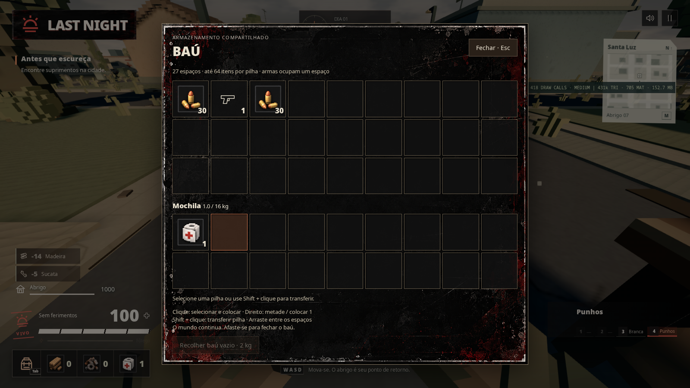
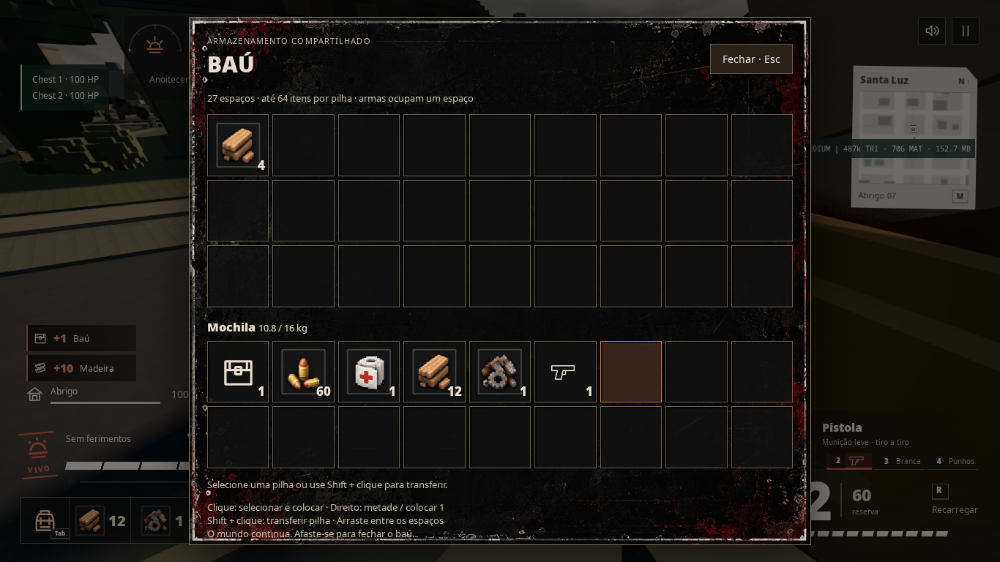

# Baús fabricados

Os baús `base-ammo` e `base-wood` deixaram de nascer na base. O depósito de recursos e o armário de armas acessíveis à distância pela mochila foram desativados. Containers da cidade continuam servindo para saquear; armazenamento do jogador exige um baú fabricado.

## Uso

- Na mesa inteligente, fabrique **Baú de madeira**: 8 madeiras + 2 sucatas. O kit pesa 2 kg.
- Na mochila, use **Posicionar baú no chão**. Ande e mire; esquerdo confirma, direito/Esc cancela.
- Mire no baú a até 3 metros e abra com o botão direito. Paredes bloqueiam o acesso.
- São 27 espaços; recursos empilham até 64. Armas ocupam um espaço e preservam identidade, raridade e munição carregada.
- Clique para selecionar e colocar, direito para selecionar metade ou colocar uma unidade, Shift + clique para transferência rápida. Também é possível arrastar entre espaços e mochila.
- O limite de peso da mochila continua valendo. Transferências sem espaço não destroem itens.
- Esc/Tab ou o botão Fechar encerram a janela; afastar-se também fecha. Uma seleção ainda não transferida permanece na origem.
- Um baú vazio pode ser recolhido e reposicionado. Limite de 24 baús por partida.

A tampa tem animação local de abertura/fechamento. O modelo e a janela usam a direção voxel/grunge existente. Esta implementação não inclui baús duplos, redstone nem armazenamento persistente entre expedições.

Receitas e reparos passam a usar materiais carregados na mochila. Recompensas do amanhecer e materiais de desmontagem vão para a mochila; excedentes são deixados no chão, sem alimentar depósito invisível.

## Coop e performance

O baú pertence ao mundo compartilhado. O coordenador valida alcance, linha de visão, quantidades, índice do espaço e revisão do conteúdo. Pedidos concorrentes com revisão antiga são recusados; não removem o item da mochila nem repetem retiradas.

Checkpoints e migração de anfitrião incluem baús e seu conteúdo. Patches enviam somente baús alterados. O orçamento de checkpoints comporta o limite de baús cheios; mensagens continuam fragmentadas no transporte existente. A mesma lógica atende Photon e LAN. O identificador de build foi atualizado para impedir que versões anteriores, sem baús, entrem na mesma sala.

## Verificação

- `npm test`: 223 testes aprovados, incluindo conservação de itens, pilhas, peso, armas, concorrência, bloqueio por parede, migração e limite de armazenamento.
- `npm run test:lan`: 3 testes aprovados.
- `npm run test:chests`: 2 cenários aprovados em Chromium com GPU: solo e dois clientes Photon reais, incluindo troca de anfitrião.
- Interface verificada em 1366×768, 1600×900 e 1920×1080.
- `npm run build` (inclui typecheck) aprovado. Permanece o aviso existente de chunk Three.js acima de 500 kB.
- `git diff --check` aprovado.

Os clientes de navegador executaram na mesma máquina. Os testes LAN verificaram o relay; a nova interface de baús foi exercitada entre dois clientes reais pelo Photon e sua lógica compartilhada foi testada diretamente no coordenador.

