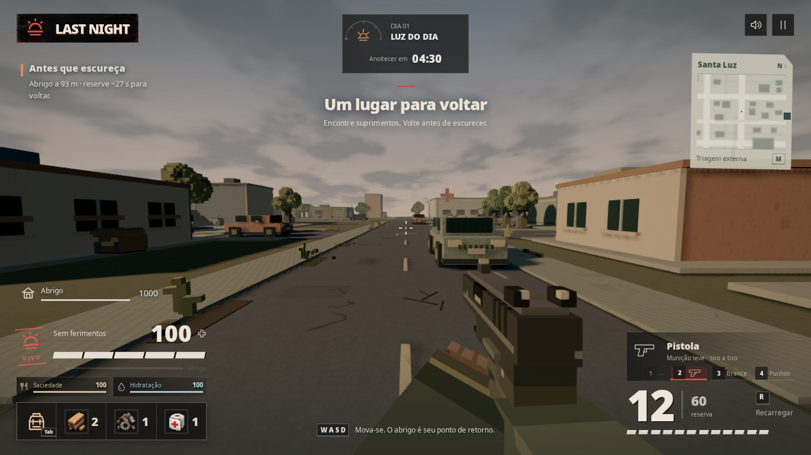
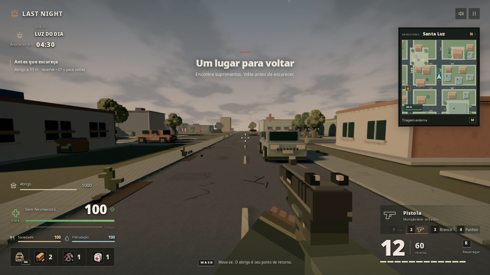
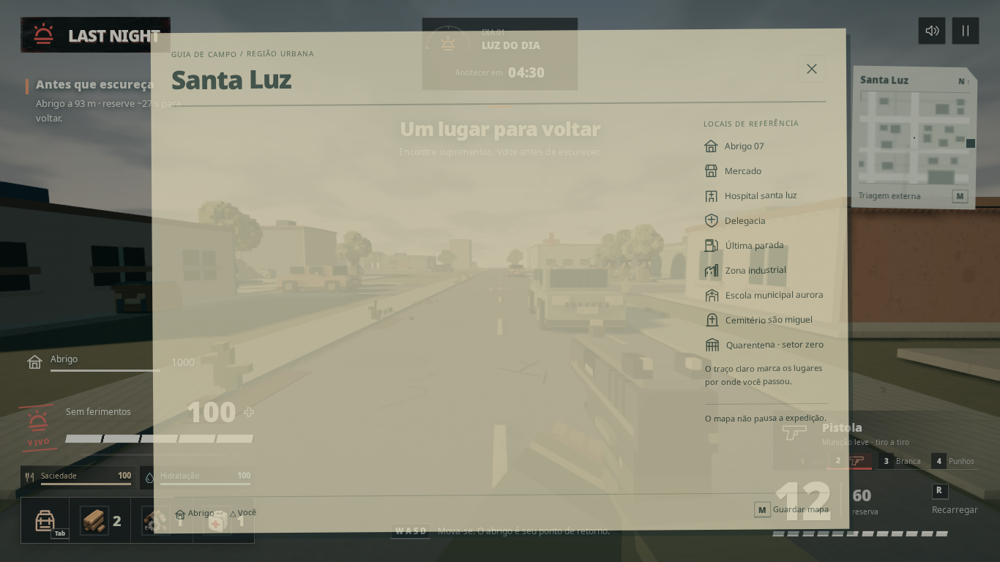
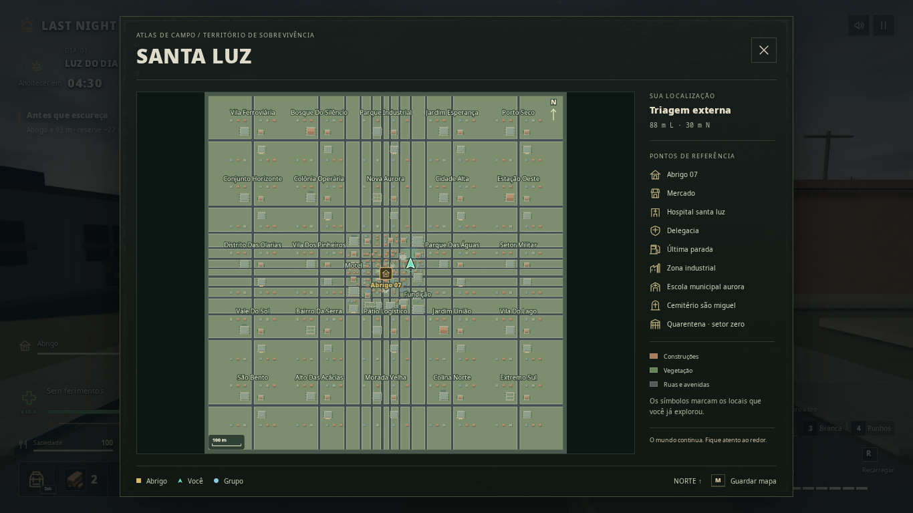

# HUD de campo e mapa de Santa Luz

A revisão organiza os instrumentos nas laterais e preserva a visão central do mundo. O relógio e os nomes do grupo têm fundo transparente. As informações da sala ficam na pausa, com acesso ao convite. Vida aparece como número e barra; estados de ferimento, incapacitação e morte continuam legíveis sem depender apenas de cor.

O minimapa ficou maior, quadrado e sem o filtro cinza. O desenho usa os dados de Santa Luz para representar ruas, calçadas, construções, telhados, vegetação e veículos. O mapa completo recebeu a mesma geografia colorida, com legenda, localização e coordenadas. Ele continua sem pausar a partida.

As mudanças são compartilhadas entre solo e coop. Não há alterações em dano, receitas, loot, IA, protocolos, economia ou geometria 3D do jogo. A mesa inteligente revisada anteriormente permanece no projeto.

## Comparação

Capturas no mesmo trecho de rua, posição, direção e período do dia em 1366×768:

| Antes | Depois |
| --- | --- |
|  |  |
|  |  |

O cenário 3D não foi modificado nesta revisão. A notificação de início da partida é temporária.

## Implementação

- `src/ui/field-hud.css`: composição, transparência, barras, mapa completo e adaptação de tela.
- `src/ui/layout.ts` e `src/ui/hud.ts`: estrutura, legendas, localização e valores acessíveis dos indicadores.
- `src/ui/map.ts` e `src/ui/map-atlas.ts`: mapa colorido, recortes de alta definição, orientação e marcadores.
- `src/ui/coop-gameplay.ts`: linhas estáveis do grupo e seus estados de vida.
- `src/ui/coop.ts` e `src/ui/coop-hud.css`: dados da sala na pausa e apresentação do grupo.
- `tests/field-hud.spec.ts` e `playwright.field-hud.config.ts`: regressão visual e funcional.

Não foram instaladas dependências nem baixados assets. A cartografia é desenhada em Canvas2D a partir dos dados do jogo. Ícones, fonte e textura existentes foram reaproveitados.

## Validação final

- `npm run build`: typecheck e build aprovados; permanece o aviso do Vite sobre chunks acima de 500 kB.
- `npm test`: 244 testes aprovados nesta revisão.
- Teste de navegador solo aprovado em 1366×768, 1600×900, 1920×1080 e 960×640, incluindo escala da interface em 120%.
- Conferidos: vida real de 73 HP e barra correspondente, fundo transparente do relógio, proporção quadrada e cores dos mapas, limites da tela, inventário, pausa e recuperação do Pointer Lock ao fechar o mapa.
- A primeira validação encontrou um mapa completo com altura zero por herança de alinhamento do CSS antigo. A linha da grade e o alinhamento foram corrigidos; novas capturas confirmam o mapa visível.
- Evidência automatizada: [validation.json](validation.json). Imagem sem a notificação inicial: [HUD em gameplay](after-solo-clean-1366x768.png).
- Dois clientes Photon reais: teste aprovado, com vida de 73 HP sincronizada, linhas estáveis, estados caído/morto, relógio e nomes transparentes, código/controles do convite na pausa, mapa e retomada do Pointer Lock. Evidência: [coop-validation.json](coop-validation.json), [HUD coop](after-coop-1366x768.png) e [pausa](after-coop-pause.png).
- LAN não recebeu nova sessão de conexão nesta validação rápida; seus controles existentes de convite e seu transporte foram preservados.

O minimapa reutiliza até 12 imagens de 512×512 pixels (12 MiB de pixels RGBA), desenhadas conforme os trechos entram em uso. O panorama completo de 1536×1536 pixels é criado ao abrir o mapa (9 MiB). Esses valores não incluem overhead do navegador. A apresentação atualiza a 5 Hz, apenas no mapa visível; os companheiros usam as posições já interpoladas dos avatares, sem novas mensagens de rede. Não foi medido ganho de FPS nesta revisão.
