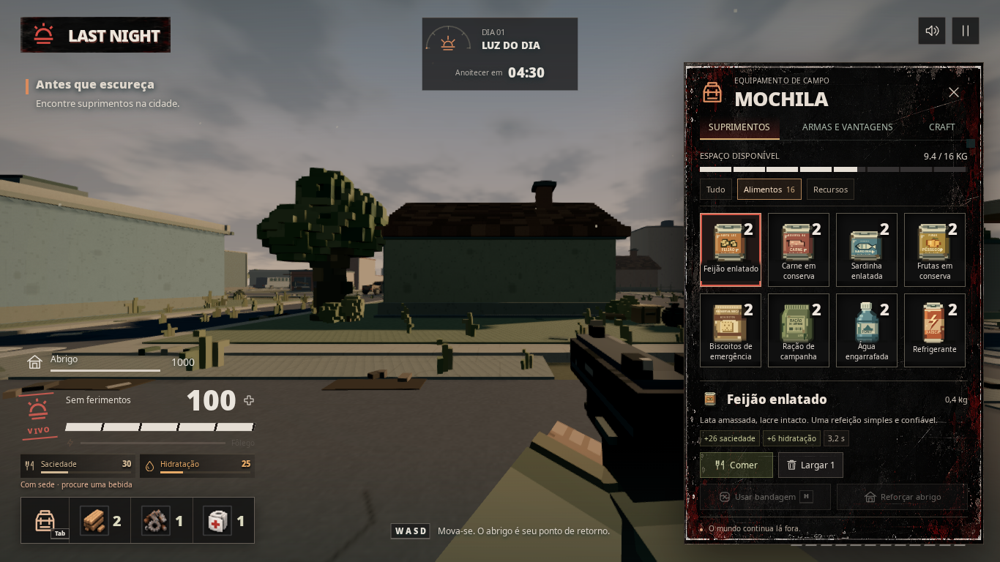
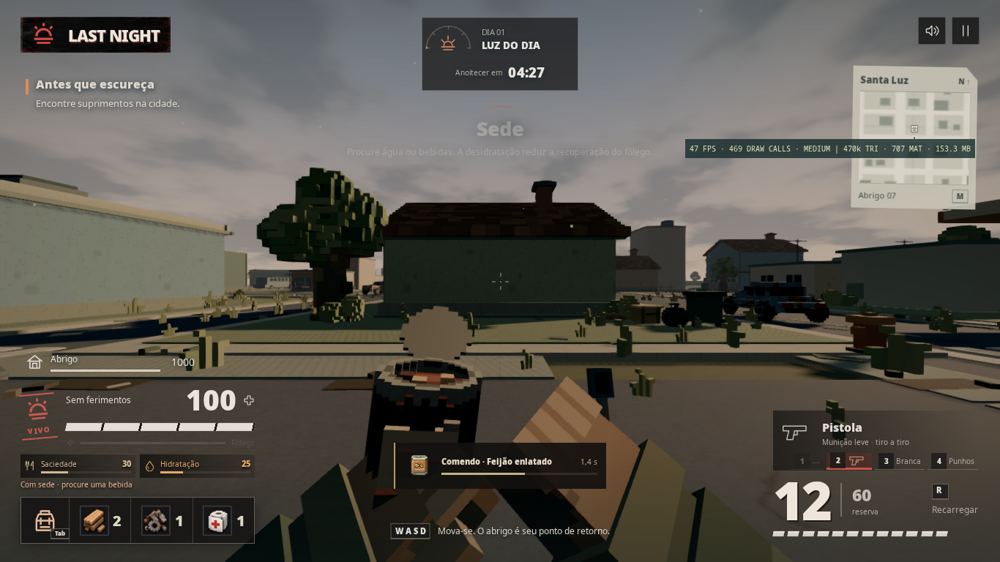
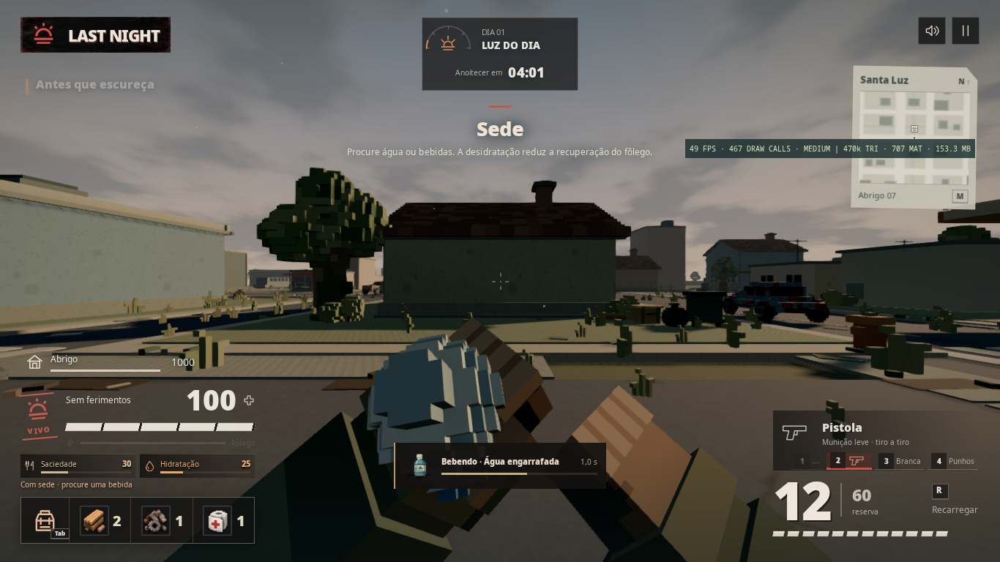

# Alimentação, hidratação e provisões de Santa Luz

Implementação compartilhada pelo solo, Photon e LAN/WebRTC. O sistema usa a simulação, inventário, containers e baús existentes. Nenhuma dependência foi adicionada.

## Como jogar

Abra **Tab → Suprimentos → Alimentos**, selecione um mantimento e use **Comer** ou **Beber**. A arma baixa, as mãos abrem a embalagem e executam o consumo. A mochila fecha para manter o mundo visível. Saciedade e hidratação aparecem junto dos indicadores de vida e fôlego.

O item só é gasto ao terminar. Movimento, corrida, disparo, troca de equipamento, recarga, interação, bandagem ou dano interrompem a ação sem gastar o alimento. É possível consumir agachado e parado. Alimentos ocupam peso na mochila e podem ser transferidos para os baús fabricados.

## Balanço inicial

| Mantimento | Saciedade | Hidratação | Tempo | Peso |
| --- | ---: | ---: | ---: | ---: |
| Feijão enlatado | +26 | +6 | 3,2 s | 0,40 |
| Carne em conserva | +34 | −4 | 3,1 s | 0,33 |
| Sardinha enlatada | +26 | −6 | 2,9 s | 0,28 |
| Frutas em conserva | +18 | +16 | 2,8 s | 0,42 |
| Biscoitos de emergência | +16 | −5 | 2,3 s | 0,16 |
| Ração de campanha | +42 | −8 | 3,4 s | 0,32 |
| Água engarrafada | — | +42 | 2,4 s | 0,55 |
| Refrigerante | +6 | +26 | 2,2 s | 0,36 |

Os valores são limitados a 0–100. Alimentos não curam HP, preservando o papel das bandagens. Cada sobrevivente começa com as necessidades cheias.

- Saciedade cai 0,045/s; hidratação cai 0,06/s. Correr multiplica o gasto por 1,45 e 1,7, respectivamente.
- Abaixo de 25, a recuperação de fôlego diminui gradualmente. O mínimo é 58% da recuperação normal, quando ambas chegam a zero. A caminhada continua disponível.
- Em zero, a fome causa 1 HP a cada 5 s e a sede causa 2 HP a cada 5 s. Esse dano não consome armadura. No coop, segue o sistema existente de incapacitação e resgate.
- A pausa solo congela a simulação. Abrir a mochila não pausa. No coop, o mundo continua quando o jogador abre o menu; necessidades congelam enquanto está incapacitado.

As chances adicionais de mantimentos por sorteio de container são 88% no mercado, 65% em casas/postos, 35% no hospital/delegacia e 25% em áreas externas. Entre os mantimentos, 93% do peso da distribuição pertence a enlatados e bebidas, 5% a biscoitos e 2% à ração. O container inicial do mercado garante um feijão e uma água. O sorteio de comida preserva a sequência e os resultados anteriores de munição e materiais. Reposição e limite de peso continuam aplicáveis.

Esses números constituem o balanço implementado, não uma conclusão de playtest de campanhas longas. O desgaste começa lentamente para permitir exploração e construção antes de a busca por provisões tornar-se urgente.

## Apresentação

Oito modelos voxel originais compartilham geometria e materiais. Conservas possuem aros, emendas, rótulos gastos, manchas, lingueta, tampa articulada e conteúdo. A água tem garrafa nervurada, tampa e rótulo próprio; biscoitos e ração têm embalagens seladas. O refrigerante abre pela lingueta.

O gesto de consumir tem etapas de levantar, abrir, levar à boca e guardar. Conservas usam colher; bebidas inclinam o recipiente; pacotes recebem um gesto próprio. Os braços usam o solver existente de ombro/cotovelo para manter comprimentos constantes. A corrida ganhou transição suave, abaixamento do equipamento e balanço da mão de apoio. O dano produz um recuo corporal breve sem alterar os raios de mira ou o dano das armas.

O foley de abertura, embalagem, mordida e bebida é sintetizado localmente e respeita volume e limite de vozes. As animações de alimentação dos companheiros são reproduzidas a partir do estado existente de rede; não há transmissão de partículas ou transformações por osso.

Os oito ícones SVG foram desenhados para esta atualização, com marcas fictícias e cores distintas. Autoria e origem: [FOOD_ART.md](../../public/ui/items/FOOD_ART.md). Não foram baixados assets, fontes ou sons externos.

## Rede e custo

O anfitrião valida o início, mantém o progresso, debita um único item e aplica as necessidades. A réplica anima a ação, sem conceder os efeitos por conta própria. Checkpoints, patches e migração preservam necessidades individuais, consumo em andamento e alimentos nos baús. O identificador de build foi atualizado para evitar misturar clientes antigos e novos na mesma sala.

Os modelos são preparados durante a tela de carregamento, incluindo um desenho fora da tela para enviar os recursos à GPU. Cada provisão usa no máximo quatro meshes e menos de 12 mil triângulos, verificados em teste. Os modelos permanecem em cache, e os indicadores da interface são atualizados no ritmo de 10 Hz do HUD. Não foram adicionadas luzes ou texturas externas grandes. Esta etapa não contém um benchmark comparativo controlado de FPS; o contador presente nas capturas é uma leitura pontual do teste.

## Validação

- `npm test`: **244 testes aprovados**, incluindo 19 novos testes de nutrição, coop e movimento/geometria.
- `npm run build`: typecheck e build aprovados. Permanece o aviso de tamanho do chunk do Three.js (~501 kB), sem erro de compilação.
- `npm run test:nutrition` com Chromium e WebGL: **3 cenários aprovados**, solo, Photon e LAN.
- Solo: consumo dos oito itens, cancelamento por movimento e golpe de infectado, retorno ao disparo com ADS, corrida e mochila em 1920×1080, 1366×768 e 960×640. Os testes verificam que os ícones carregaram e que cabeçalho/botão de consumo permanecem visíveis. O cenário solo foi repetido com sucesso após o ajuste final da garrafa.
- Coop: dois contextos de navegador para cada conexão; consumo individual validado pelo anfitrião, interrupção por movimento, armazenamento compartilhado e preservação após saída/migração do anfitrião. A validação LAN ocorreu na mesma máquina, com os dois participantes conectados por WebRTC; não constitui teste de roteadores ou computadores físicos diferentes.
- Testes da simulação cobrem consumo exatamente uma vez, rejeição de item inválido/replay, perda do item durante a ação, dano, fome crítica, armadura, incapacitação, estado malformado e consumo parado/agachado.

Durante a revisão foram corrigidos o recorte dos controles da mochila em janelas menores, ícones ainda ausentes na primeira captura, proximidade excessiva das mãos/garrafa, consumo agachado bloqueado no coop e liberação prematura da exaustão quando a recuperação era reduzida pela fome.

## Capturas finais

Também estão nesta pasta as capturas dos outros seis mantimentos, mochila em 1920/960 pixels, corrida e sessões Photon/LAN. Os resultados do consumo solo estão em [solo-validation.json](solo-validation.json).

## Principais arquivos

`src/game/nutrition.ts` centraliza efeitos e ritmo das necessidades. A integração de regras fica em `simulation.ts`, `inventory.ts`, `loot.ts` e `base-loot.ts`. `src/network/coop-world.ts`, `coop-session.ts`, `checkpoint.ts` e `gameplay-protocol.ts` mantêm a autoridade e validação. Modelos/animações ficam em `src/render/food-assets.ts`, `nutrition-motion.ts`, `viewmodel.ts` e `remote-players.ts`; áudio em `src/game/audio.ts`. A interface fica em `src/ui/nutrition.ts`, `nutrition.css`, `hud.ts` e `public/ui/items/food-*.svg`.
