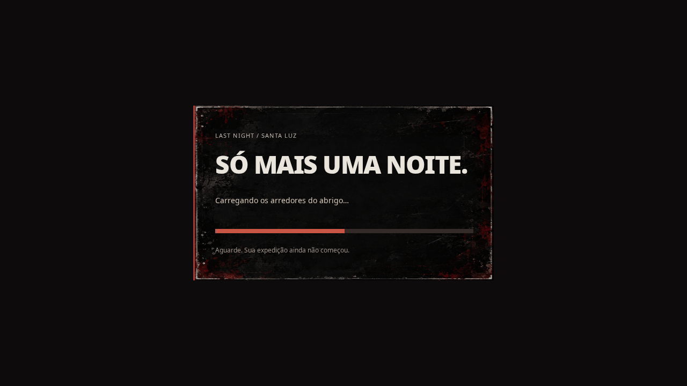

# Correção da preparação gráfica inicial

## Revisão de 28/09/2026: tela de carregamento e deploy Photon

A preparação anterior acontecia somente antes do menu e não resolveu a queda
relatada pelo jogador. Agora há uma tela opaca, com o painel grunge existente,
desde o HTML inicial e novamente antes de cada partida solo/coop. Ela mostra as
etapas reais da preparação: iluminação, equipamento, arredores e sons/interface.
A barra indica etapas concluídas, não uma estimativa de tempo.

O cenário é preparado com o spawn e as configurações atuais da partida. Quatro
direções e a lanterna passam pelo pipeline real fora da tela; a GPU confirma a
conclusão. A câmera é restaurada antes de liberar os controles. O áudio fornecido
é decodificado durante o carregamento, preservando o fallback procedural se um
arquivo não puder ser carregado. O tempo, movimento e combate não avançam nessa
etapa. Nenhum preset, material, efeito visual ou regra de gameplay foi reduzido.

No Photon, `onStart` agora pode ser assíncrono. O cliente só confirma `loaded`
depois de concluir a preparação; o líder aguarda todos os participantes antes de
iniciar o mundo. Uma conexão encerrada invalida a conclusão pendente.

O bundle público `index-D1IGeaP2.js` de `ltnight.netlify.app`, inspecionado em
28/09/2026, continha somente o retorno de erro de App ID dentro de `connect`,
sem o caminho de conexão. O build publicado omitiu `VITE_PHOTON_APP_ID`.
O commit anterior não alterou `src/network`, `vite.config.ts` nem `.gitignore`,
mas os testes anteriores não verificavam a configuração do deploy remoto.

`netlify.toml` passa a configurar o build e centralizar o mesmo App ID **público
do cliente** usado localmente. Nenhuma credencial administrativa foi incluída.
O build da Netlify falha explicitamente se esse identificador estiver inválido.
As variáveis `VITE_*` são incorporadas na compilação, portanto é necessário
um novo deploy para reparar a versão pública.

Validação local desta revisão:

- 168 testes de lógica passaram; typecheck e build passaram.
- Low/High: 60 quadros em cada um dos três primeiros segundos medidos após a
  tela de carregamento, zero compilações de shader durante esse intervalo,
  1920×1080/DPR 1/RX 6650 XT. Isso não garante a mesma cadência em outro hardware.
- Tela visível e controles bloqueados com GPU pendente; mudança Low→High no menu
  respeitada; relógio parado; convite preservado; seis gravações decodificadas.
- Dois clientes Photon reais: o cliente rápido aguarda o cliente lento sem
  avançar a partida; ambos entram quando a preparação termina.
- Áudio, seis armas, mira, recarga, movimentação, retry, loot, portas e migração
  do líder passaram nas cinco regressões de gameplay.
- Bundle de produção local: solo, inventário, pausa e sala Photon com dois
  clientes passaram sem hooks de desenvolvimento.
- Interface High: menu, configurações, inventário responsivo e pausa passaram
  em solo e em dois clientes Photon reais.



O teste `playwright.production.config.ts` cobre o bundle final sem hooks de
desenvolvimento. `LAST_NIGHT_TEST_URL=https://ltnight.netlify.app` direciona esse
teste à publicação; sem a variável, usa o preview local de `dist`.

## Histórico da primeira correção

O menu era liberado antes de o renderizador preparar todos os recursos da
primeira pessoa. A renderização do fundo do menu não visitava a arma nem todos
os materiais vistos ao nascer. A instrumentação anterior à correção registrou
nove chamadas de compilação/link de shaders depois do clique em Jogar.

Agora a inicialização prepara os shaders do mundo e da arma no mesmo render
target HDR usado na partida e desenha os passes de gameplay e menu fora da tela.
Isso também prepara buffers, texturas, sombras e alvos do pós-processamento.
Uma fence WebGL 2 confirma a conclusão da GPU sem bloquear a thread em espera.
Só então o menu fica interativo e o loop normal começa. Não há espera fixa,
limitação nova de FPS ou redução automática de qualidade.

Durante essa preparação, o botão mostra “Preparando Santa Luz…”. A simulação
não avança. Links de convite abrem o lobby depois da preparação; a captura do
mouse e a ativação do áudio continuam vinculadas ao gesto do jogador.

As mudanças de produção estão limitadas a `src/main.ts` e `src/render/scene.ts`.
Os presets, iluminação, GTAO, bloom, materiais, modelos, HUD, inventário, áudio,
regras de gameplay e protocolo Photon foram preservados.

## Medição após a correção

Chromium 153 / Playwright 1.63, GPU AMD Radeon RX 6650 XT via ANGLE/OpenGL,
viewport 1920 × 1080, DPR 1. Contexto novo, entrada pelo menu no primeiro
momento permitido e contagem dos callbacks do loop real por três segundos.
Sem profiler de CPU durante a medição. Testes executados sequencialmente.

| Preset | 1º segundo | 2º segundo | 3º segundo | Compilações antes de jogar | Compilações após jogar |
| --- | ---: | ---: | ---: | ---: | ---: |
| Low | 59 quadros | 60 quadros | 60 quadros | 54 | 0 |
| High | 60 quadros | 60 quadros | 60 quadros | 84 | 0 |

Registros: [low.json](low.json) e [high.json](high.json). High mantém GTAO em
meia resolução, bloom, AgX e exposição 0,94. As compilações acima são chamadas
a `compileShader`, não a quantidade de programas únicos.

A queda sustentada até 30 FPS relatada não foi reproduzida neste hardware.
Foi confirmado e removido o trabalho gráfico tardio na entrada da partida.
As contagens são medições de cadência do loop, não tempo GPU nem garantia de
60 FPS em qualquer computador; o sistema operacional ainda pode causar variações.

## Validação

- `npm test`: 168 testes passaram.
- `npm run build`: typecheck e build passaram.
- Inicialização: preparação nos presets Low/High, nenhuma compilação tardia,
  Pointer Lock, mochila, pausa e retomada; bloqueio dos controles enquanto a GPU
  está pendente; link de convite preservado; tempo da simulação permanece zero.
- Regressão: dois testes de áudio, seis armas, movimentação/Pointer Lock e dois
  clientes Photon com combate, disputa de loot, portas e migração de líder.
- Interface: menu, ajustes, créditos, inventário responsivo e pausa em High;
  lobby, inventário e pausa em dois clientes Photon reais.
- Nenhum erro de console nos testes de entrada e interface.

Para repetir a regressão de inicialização:

```sh
LAST_NIGHT_GPU=1 PLAYWRIGHT_BROWSERS_PATH=/tmp/last-night-browsers npx playwright test --config playwright.startup.config.ts
```

O caminho acima contém o Chromium temporário usado na validação. Ajuste-o à
instalação local do Playwright. Sem `LAST_NIGHT_GPU=1`, a configuração herdada
usa SwiftShader, adequado a verificações funcionais, não a medir FPS da GPU.
