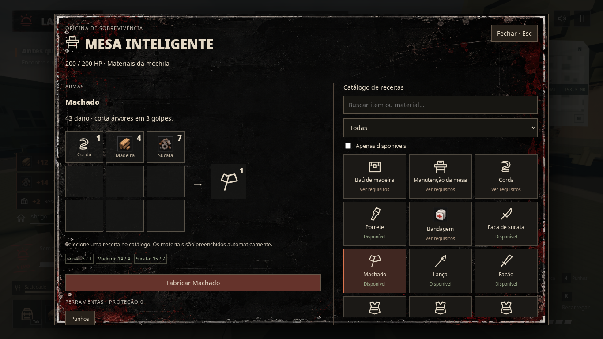
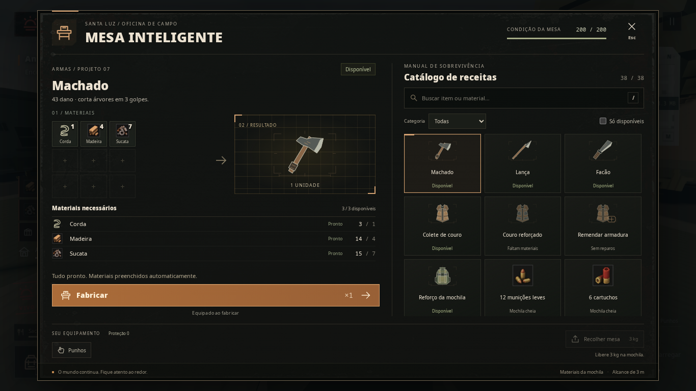

# Mesa inteligente — revisão de interface

Validação em 1 de outubro de 2026. Alterações limitadas à apresentação e à atualização da interface compartilhada entre solo e coop.

## Apresentação e uso

O menu ganhou uma direção de oficina de campo: carvão, detalhes em cobre, textura gasta discreta e desenhos técnicos dos objetos. A grade de montagem permanece à esquerda e o catálogo à direita. O resultado tem uma prévia maior; materiais, quantidades necessárias, estoque e faltas aparecem em linhas separadas. O botão de fabricar e seu motivo de bloqueio ficam fora da área rolável dos detalhes.

As 38 receitas da mesa, seus custos, efeitos, requisitos e caminhos de execução continuam usando o sistema existente. A mochila continua oferecendo somente a fabricação da própria mesa. A interface também mantém equipar ferramentas, condição da mesa, proteção e recolher a mesa.

A busca aceita termos com ou sem acento, nomes de materiais e múltiplas palavras. Categoria e disponibilidade podem ser combinadas. Uma busca vazia possui explicação e botão para limpar filtros. `/` foca a busca; setas, Home e End navegam nos cartões focados; Enter seleciona e Esc fecha. Os atalhos de gameplay não são acionados enquanto se digita na busca.

## Otimização

O catálogo é criado uma vez. Alterar estoque atualiza contagens, estados e visibilidade, preservando os elementos, foco, seleção de texto e rolagem. Dados estáticos de busca e ilustrações são armazenados em cache. A disponibilidade é recalculada quando os dados relevantes mudam, com uma verificação adicional a cada 400 ms para obstáculos móveis. A fabricação real continua sendo validada pelo sistema de gameplay e pelo fluxo coop existente.

Medição com MutationObserver em duas janelas de 600 ms, registrada em [validation.json](validation.json):

| Situação | Elementos criados/removidos | Nós de texto criados/removidos |
| --- | --- | --- |
| Menu aberto, estoque estável | 0 / 0 | 0 / 0 |
| Madeira alterada de 14 para 15 | 0 / 0 | 1 / 1 |

Isso verifica a estabilidade do DOM da mesa; não representa uma medição de ganho de FPS do mundo 3D.

## Verificação

- `npm run build`: typecheck e build aprovados. O Vite mantém o aviso de chunks acima de 500 kB.
- `node --experimental-strip-types tests/crafting.test.ts`: 27 testes aprovados.
- `playwright.crafting.config.ts`: três cenários existentes aprovados — solo; dois clientes Photon com mesa compartilhada e migração de anfitrião; fortificações, armadilhas, portão e distritos distantes. Resultados preservados em [regression.json](regression.json).
- `npm run test:workbench`: busca, filtros, cliques lentos/repetidos, mudanças de estoque durante cliques, foco/cursor/rolagem, custo debitado uma vez, fechar/reabrir e recolher a mesa.
- Capturas e limites de layout verificados em 1366×768, 1920×1080 e 960×640. Os três ingredientes do machado aparecem por inteiro sem rolagem nesses tamanhos. Receitas mais extensas continuam usando a área rolável, sem deslocar a ação de fabricar.
- Um caso de arredondamento foi corrigido na interface: recolher a mesa usa a mesma tolerância de peso do inventário. O teste verifica o bloqueio acima da capacidade e a permissão quando materiais decimais somam matematicamente 13 kg, deixando os 3 kg exatos da mesa.
- Nenhum erro JavaScript nos cenários registrados.

LAN não recebeu um teste de conexão separado nesta revisão. Usa a mesma interface e callbacks, sem alterações no transporte de rede. Não foi feito um perfil comparativo de FPS; a otimização medida aqui é a redução de trabalho e substituições no DOM.

## Antes e depois

Mesma bancada, receita, estoque e enquadramento de jogo em 1366×768.

Antes:

Depois:

Outras resoluções: [1920×1080](after-1920x1080.png) · [960×640](after-960x640.png).

## Arquivos e arte

- `src/ui/crafting.ts`: estrutura, eventos e atualização estável do menu.
- `src/ui/workbench.css`: composição, estados e adaptação de tamanho.
- `src/ui/recipe-art.ts`: 23 desenhos SVG originais para ferramentas, armas, equipamentos e estruturas; sem cena 3D adicional.
- `src/style.css`: retirada das regras antigas do menu, mantendo as indicações de posicionamento.
- `tests/workbench-ui.spec.ts` e `playwright.workbench-ui.config.ts`: validação isolada do menu.
- `tests/crafting.spec.ts`: a busca verifica cartões visíveis, pois o catálogo agora preserva os elementos ocultos.
- `package.json`: comando `test:workbench`.

Os ícones de suprimentos e o fundo grunge já existentes foram reutilizados. Não foram baixados assets ou fontes, nem instaladas dependências. Os desenhos novos são código SVG original criado para o projeto.
